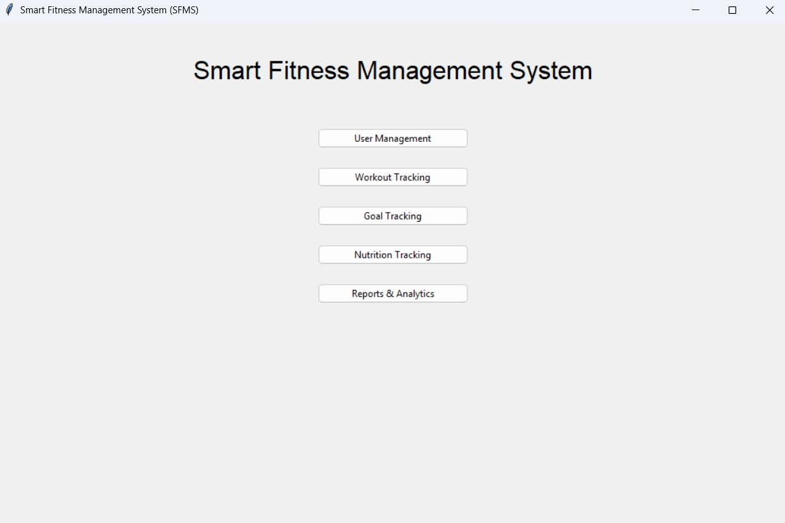
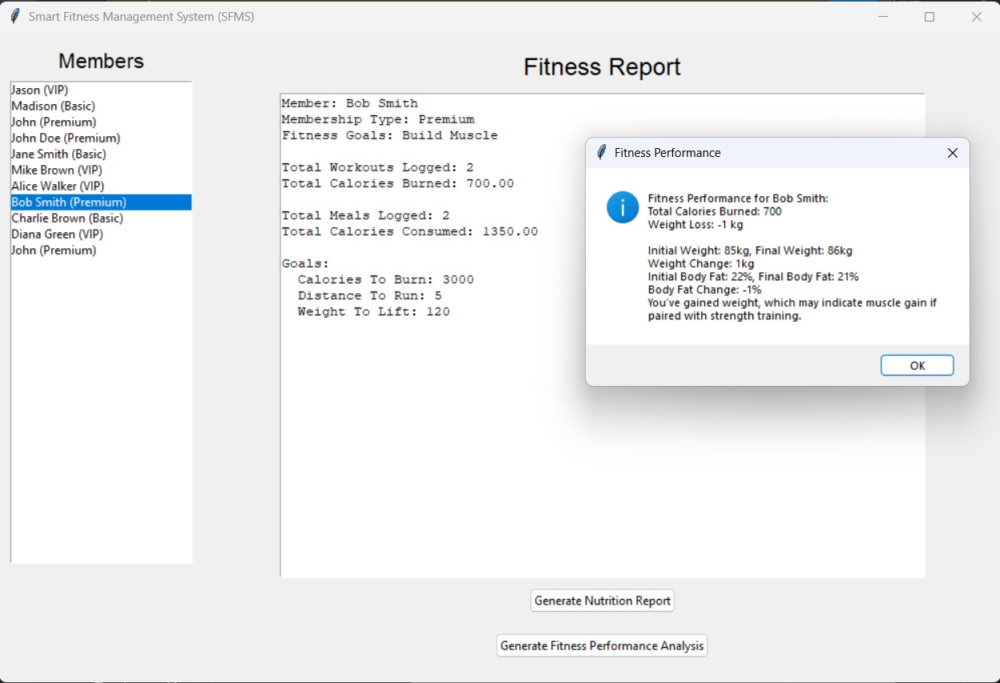
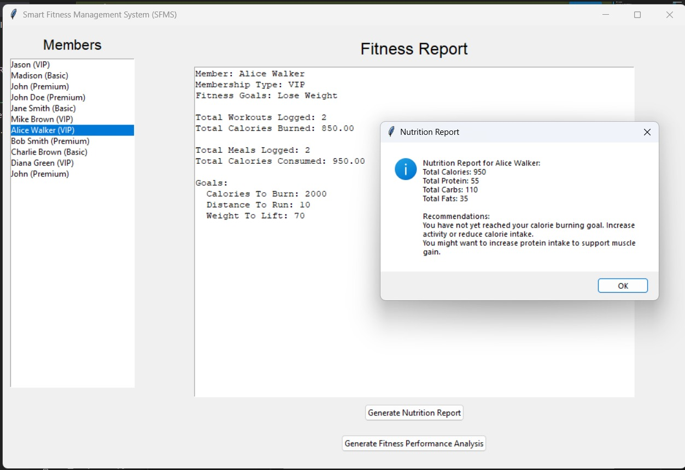
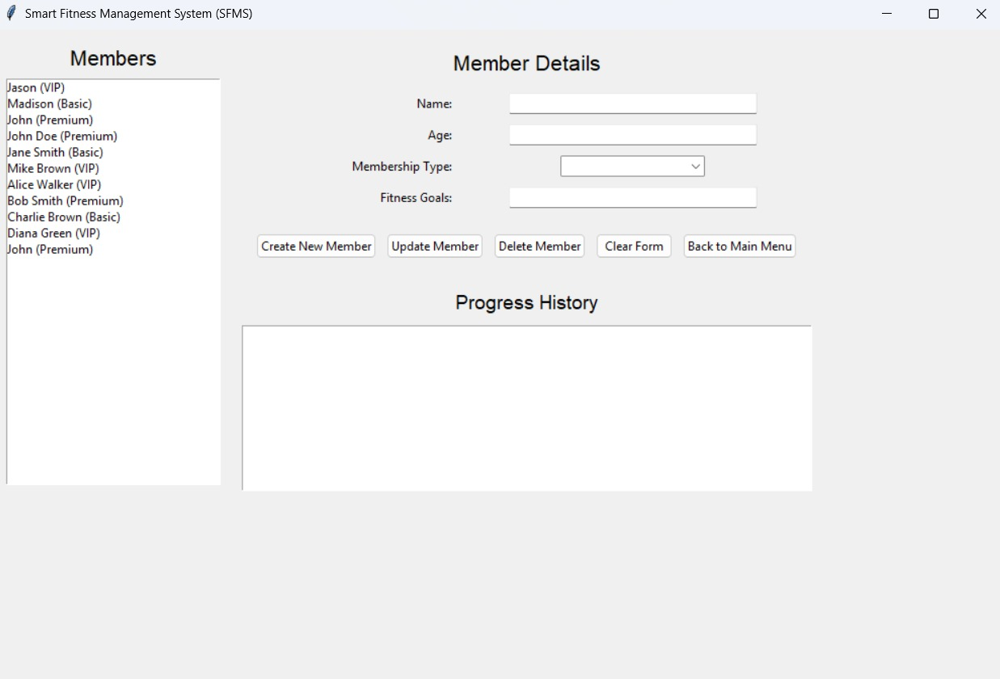

# Smart Fitness Management System with GUI (Tkinter)

This project is a Smart Fitness Management System built with Python and a graphical user interface using Tkinter. It allows users to manage gym/fitness center members, track their data, and perform various operations through an intuitive GUI.

## Features

- Add, update, and delete member records
- Store member data in JSON format
- User-friendly Tkinter-based interface
- Generate reports

## Requirements

- Python 3.x
- Tkinter (usually included with Python)

## Getting Started

1. Clone or download this repository.
2. Ensure you have Python 3 installed.
3. Run the application:
   ```bash
   python sfms_complete.py
   ```

## Files

- `sfms_complete.py`: Main application file with the GUI and logic.
- `sfms_members_data.json`: Stores member data in JSON format.
- `Python GUI Report.pdf`: Project report/documentation.

## Screenshots

Below are some screenshots of the application in action:

<p align="center">
   
   
   
   
</p>

## License

This project is for educational purposes.
